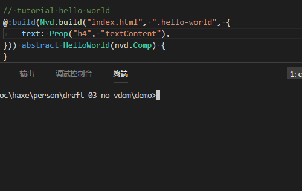
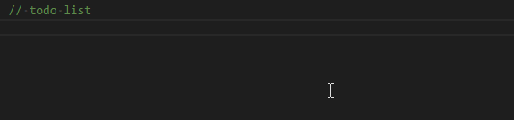
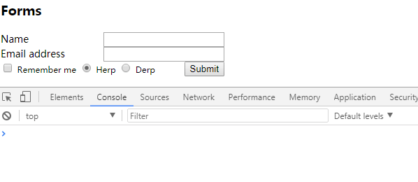

no-vdom
--------

A haxelib for building HTML `macro components`:

* Easy *If you know css selector and haxe, you will understand all the syntax in just 1 minutes.*

  > no jsx and no need add any extra meta/info to HTML

* Intelligent:

  

* Strictly type: *As shown in the bottom GIF*

  for example the `<button>` will be recognized as `js.html.ButtonElement`

* **Zero Performance Loss**.

* IE8+ Support. *Note: Need to add polyfills. e.g: [textContext](http://eligrey.com/blog/post/textcontent-in-ie8)*

* issues:
  - can not recognize SVG Element which will be treated as a DOMElement.
  - Comment, CDATA and ProcessingInstruction cannot be included in HTML fragment. (will throw an error.)

## Demo

all the code below is in [demo](demo/Demo.hx?ts=4)

### hello world

```html
<!-- html fragment in index.html -->
<div class="hello-world">
  <h4>hello world</h4>
</div>
```

**Component**: (use `macro` and `abstract` to define it.)

```haxe
@:build(Nvd.build("index.html", ".hello-world", {
  text: Prop("h4", "textContent"),
})) abstract HelloWorld(nvd.Comp) {
}

class Demo {
  static function main() {
    var hw = HelloWorld.ofSelector(".hello-world");
    hw.text = "你好, 世界!";
  }
}

// build: haxe -dce full -D analyzer-optimize -main Demo -lib no-vdom -js demo.js
```

Output:

```js
// Generated by Haxe 4.0.0 (git build development @ e6f3b7d)
(function () { "use strict";
var Demo = function() { };
Demo.main = function() {
  window.document.querySelector(".hello-world").children[0].textContent = "你好, 世界!";
};
Demo.main();
})();
```

#### Docs

Back to the top of the **Component**, The macro will automatically generate the following code:

  > Add the Compile flag "-D dump=pretty" and you will find it in the `dump` directory

```haxe
abstract HelloWorld(nvd.Comp) {
  // added automatically
  public var d(get, never): js.html.DOMElement;
  @:to inline function get_d(): js.html.DOMElement { return cast this; }

  public inline function new(dom: js.html.DOMElement) { this = dom; }

  public static inline function ofSelector(css_selector: String): HelloWorld {
    return new HelloWorld(document.querySelector(css_selector));
  }
  public static inline function create(): HelloWorld {
    return nvd.Dt.create(/* auto filled by macro */);
  }

  // The code below is generated based on the defs
  public var text(get, set): String;
  inline function get_text(): String {
    return d.children[0].textContext;
  }
  inline function set_text(s: String): String {
    d.children[0].textContext = s;
    return s;
  }
}
```

Syntax: *Note that the following is pseudo code*

```haxe
/**
@file: Specify an HTML file, Relative to current project.
@root: a css selector will specify a **root DOMElement** of the Component.
@defs: Optional. See **DefType** for details. example:
  {
    text: Prop("label", "textContext"),
    btn : Elem("button"),
    value: Attr("input[type=button]", "value")
    x: Style(null, "left"),
    y: Style(null, "top")
  }
*/
Nvd.build(file: String, root: String, ?defs: Dynamic<Defines>);

/**
@child: a css selector that used to specify a child DOMElement , if null it's represented as root DOMElement.

  (In fact, this parameter can also be an array that describes the location relative to the root DOMElement).
@name:
@keep: Optional, if true that will keep the "css-selector"(first parameter) in output.
*/
enum DefType {
  Elem(?child: String, ?keep: Bool)
  Prop(?child: String, prop_name: String, ?keep: Bool)
  Attr(?child: String, attr_name: String, ?keep: Bool)
  Style(?child:String, style_name:String, ?keep: Bool)
}
```

This is all the Syntax.

### form data

```html
<div id="login" style="width: 320px; font-size: 14px">
  <div style="clear: both">
    <label for="name" style="float:left;">Name</label>
    <input style="float:right" type="text" name="name" />
  </div>
  <div style="clear: both">
    <label for="email" style="float:left;">Email address</label>
    <input style="float:right" type="email" name="email">
  </div>
  <div style="clear: both">
    <label style="font-size: 12px"><input type="checkbox" /> Remember me </label>
    <label style="font-size: 12px"><input type="radio" name="herpderp" value="herp" checked="checked" /> Herp </label>
    <label style="font-size: 12px"><input type="radio" name="herpderp" value="derp" /> Derp </label>
    <button style="float:right" type="submit">Submit</button>
  </div>
</div>
```

Component:

```hx
@:build(Nvd.build("index.html", "#login", {
  btn: Elem("button[type=submit]"),
  name: Prop("input[name=name]", "value"),
  email: Prop("input[name=email]", "value"),
  remember: Prop("input[type=checkbox]", "checked"),
  // the last argument "true" is used to keep css-selector in output
  herpderp: Prop("input[type=radio][name=herpderp]:checked", "value", true),
})) abstract LoginForm(nvd.Comp) {
  public inline function getData() {
    return {
      name: name,
      email: email,
      remember: remember,
      herpderp: herpderp,
    }
  }
}
```





```hx
class Demo {
  static function main() {
    // login
    var login = LoginForm.ofSelector("#login");
    login.btn.onclick = function() {
      trace(login.getData());
    }
  }
}
```

output:

```js
// Generated by Haxe 4.0.0 (git build development @ e6f3b7d)
(function () { "use strict";
var Demo = function() { };
Demo.main = function() {
  var login = window.document.querySelector("#login");
  login.children[2].children[3].onclick = function() {
    console.log("Demo.hx:9:",{ name : login.children[0].children[1].value, email : login.children[1].children[1].value, remember : login.children[2].children[0].children[0].checked, herpderp : login.querySelector("input[type=radio][name=herpderp]:checked").value});
  };
};
Demo.main();
})();
```

## CHANGES

* 0.3.1 minor
* 0.3.0 Added `Style(sel, cssname)`
* 0.2.0 Allow keep css-selector in output.
