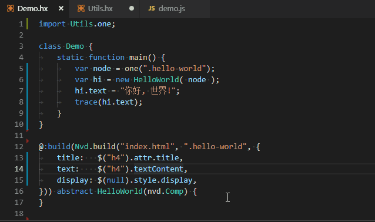

no-vdom
--------

A haxelib for HTML data building in macro

* Easy

* Intelligent:

  

* Strictly type: *As shown in the bottom GIF*

  > for example the `<button>` will be recognized as `js.html.ButtonElement`

* **Zero Performance Loss**.

* IE8+ Support. *Note: Need to add polyfills. e.g: [textContext](http://eligrey.com/blog/post/textcontent-in-ie8)*

* issues:
  - can not recognize SVG Element which will be treated as a DOMElement.
  - Comment, CDATA and ProcessingInstruction are not allowed to be placed in HTML fragment. (an error will be thrown)

* utils:

  Verify css query:

  ```haxe
  // 1. define a "macro function" and put it in "non-js" module/class file
  macro static function one(selector) {
    return Nvd.buildQuerySelector("bin/index.html", selector);
  }

  static function main() {
    var node = one(".hello"); // Can be automatically recognized as XXXElement
    var typo = one(".typo");  // If ".typo" is not found then you'll get an error in compile time
  }
  ```
  

## Demo

all the code below is in [demo](demo/Demo.hx?ts=4)

### hello world

```html
<!-- html fragment in index.html -->
<div class="hello-world">
  <h4>hello world</h4>
</div>
```

**Component**: (use `macro` and `abstract` to define it.)

```haxe
@:build(Nvd.build("index.html", ".hello-world", {
  text: $("h4").textContent,
})) abstract HelloWorld(nvd.Comp) {
}

class Demo {
  static function main() {
    var hw = HelloWorld.ofSelector(".hello-world");
    hw.text = "你好, 世界!";
  }
}

// build: haxe -dce full -D analyzer-optimize -main Demo -lib no-vdom -js demo.js
```

Output:

```js
// Generated by Haxe 4.0.0 (git build development @ e6f3b7d)
(function () { "use strict";
var Demo = function() { };
Demo.main = function() {
  window.document.querySelector(".hello-world").children[0].textContent = "你好, 世界!";
};
Demo.main();
})();
```

#### Syntax

```haxe
/**
@file: Specify an HTML file, Relative to current project.
@root: a css selector which will be queried as **root DOMElement** for the Component.
@defs: Specify property binding, for example:
  {
    btn :   $("button"),
    text:   $("label").textContext,
    value:  $("input[type=button]").attr.value,
    x:      $(null).style.left,  // if selector is null/"" then self(root DOMElement).
    y:      $(null).style.top,
  }
*/
Nvd.build(file: String, root: String, ?defs: Dynamic<Defines>);

/**
@selector: a css selector that used to specify a child DOMElement , if null it's represented as root DOMElement.
@keep: Optional, if true that will keep the "css-selector" in output.
*/
function $(selector:String, ?keep: Bool);

/**
There are 4 types available: DOMElement/Property/Attribute/Style-Property
  $(...)              => DOMElement
  $(...).XXX          => Property
  $(...).attr.XXX     => Attribute,
  $(...).attr["XXX"]  => Attribute,
  $(...).style.XXX    => Style-Property
*/
```

### form data

```html
<div id="login" style="width: 320px; font-size: 14px">
  <div style="clear: both">
    <label for="name" style="float:left;">Name</label>
    <input style="float:right" type="text" name="name" />
  </div>
  <div style="clear: both">
    <label for="email" style="float:left;">Email address</label>
    <input style="float:right" type="email" name="email">
  </div>
  <div style="clear: both">
    <label style="font-size: 12px"><input type="checkbox" /> Remember me </label>
    <label style="font-size: 12px"><input type="radio" name="herpderp" value="herp" checked="checked" /> Herp </label>
    <label style="font-size: 12px"><input type="radio" name="herpderp" value="derp" /> Derp </label>
    <button style="float:right" type="submit">Submit</button>
  </div>
</div>
```

Component:

```hx
@:build(Nvd.build("index.html", "#login", {
  btn:      $("button[type=submit]"),
  name:     $("input[name=name]").value,
  email:    $("input[name=email]").value,
  remember: $("input[type=checkbox]").checked,  // Note: IE8 does not support the pseudo-selector ":checked"
  herpderp: $("input[type=radio][name=herpderp]:checked", true).value,
})) abstract LoginForm(nvd.Comp) {
  public inline function getData() {
    return {
      name: name,
      email: email,
      remember: remember,
      herpderp: herpderp,
    }
  }
}


class Demo {
  static function main() {
    // login
    var login = LoginForm.ofSelector("#login");
    login.btn.onclick = function() {
      trace(login.getData());
    }
  }
}
```


output:

```js
// Generated by Haxe 4.0.0 (git build development @ e6f3b7d)
(function () { "use strict";
var Demo = function() { };
Demo.main = function() {
  var login = window.document.querySelector("#login");
  login.children[2].children[3].onclick = function() {
    console.log("Demo.hx:9:",{ name : login.children[0].children[1].value, email : login.children[1].children[1].value, remember : login.children[2].children[0].children[0].checked, herpderp : login.querySelector("input[type=radio][name=herpderp]:checked").value});
  };
};
Demo.main();
})();
```

## CHANGES

* `0.4.0`: added new data binding syntax
* `0.3.3`: discard HXX.parse
